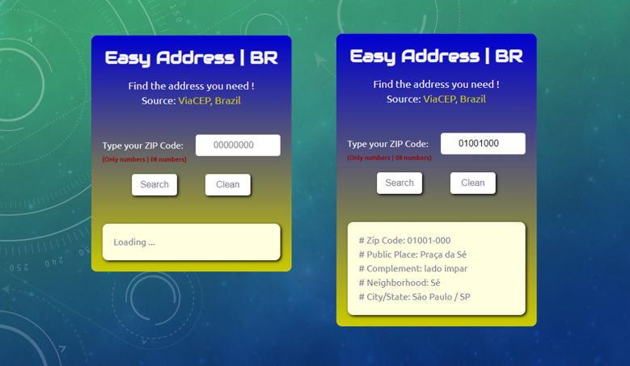

# Easy Address | BR - ViaCEP API

Project that has the purpose of searching the address through the zip code informed (Only for zip codes in Brazil). ViaCEP website API used.

The technical evolution was due to improving knowledge in asynchronous JavaScript, FETCH API, async await.

## Table of contents

- [Overview](#overview)
  - [The challenge](#the-challenge)
  - [Screenshot](#screenshot)
  - [Links](#links)
- [My process](#my-process)
  - [Built with](#built-with)
- [Author](#author)

## Overview

### The challenge

Users should be able to:

- View the optimal layout for the site depending on their device's screen size
- Search address through the ZIP Code (Only for Brazil)

### Screenshot

### Links

- [Solution URL here](https://github.com/renato-albuquerque/brazilian_zip_code-api)
- [Live Site URL here](https://renato-albuquerque.github.io/brazilian_zip_code-api/)

## My process

### Built with

- Semantic HTML5 markup
- CSS custom properties
- Flexbox
- JavaScript
- Mobile-first workflow

## Author

- Business Card - [Renato Albuquerque](https://rma-contacts.vercel.app/)
- Linkedin - [renato-malbuquerque](https://www.linkedin.com/in/renato-malbuquerque/)
- Discord - [Renato Albuquerque#0025](https://discordapp.com/users/992621595547938837)